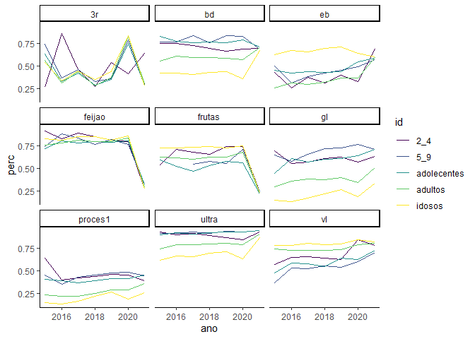

<!-- README.md is generated from README.Rmd. Please edit that file -->

# diagnosticos-pp

<!-- badges: start -->
<!-- badges: end -->

## Carregando o banco de dados

``` r
`%>%` <- magrittr::`%>%`
saude <- readr::read_rds("data/saude.rds") %>% 
  dplyr::mutate(tipo = stringr::str_to_lower(tipo))
dplyr::glimpse(saude)
#> Rows: 315
#> Columns: 7
#> $ cidade  <chr> "Bauru", "Bauru", "Bauru", "Bauru", "Bauru", "Bauru", "Bauru",~
#> $ ano     <dbl> 2015, 2015, 2015, 2015, 2015, 2016, 2016, 2016, 2016, 2016, 20~
#> $ id      <chr> "2_4", "5_9", "adolecentes", "adultos", "idosos", "2_4", "5_9"~
#> $ tipo    <chr> "ultra", "ultra", "ultra", "ultra", "ultra", "ultra", "ultra",~
#> $ total   <dbl> 56, 46, 145, 687, 311, 181, 123, 369, 2390, 1444, 220, 270, 56~
#> $ amostra <dbl> 52, 42, 131, 512, 193, 163, 113, 340, 1889, 965, 201, 251, 517~
#> $ perc    <dbl> 0.9285714, 0.9130435, 0.9034483, 0.7452693, 0.6205788, 0.90055~
```

## Visualizando a série temporal

``` r
saude %>% 
  ggplot2::ggplot(ggplot2::aes(x=ano,y=perc,color=id))+
  #ggplot2::geom_col(position = "dodge")+
  ggplot2::geom_line() +
  ggplot2::facet_wrap(~tipo,ncol=3)+
  ggplot2::scale_color_viridis_d()+
  ggplot2::theme_classic()
```

<!-- -->
